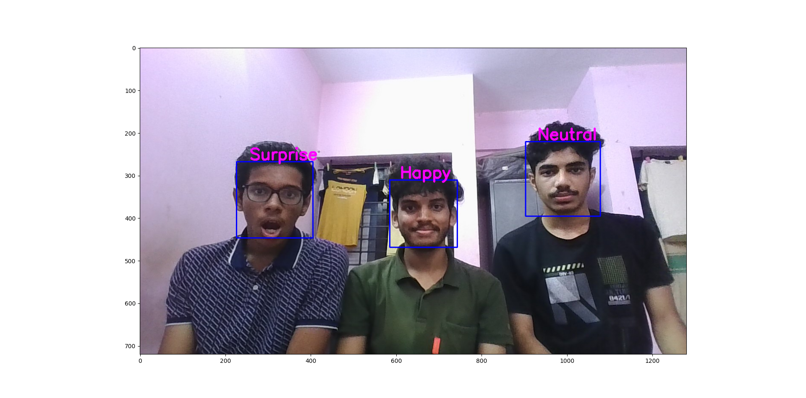
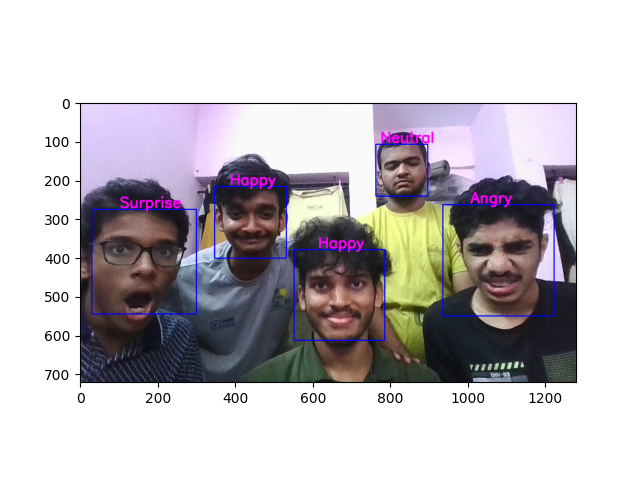
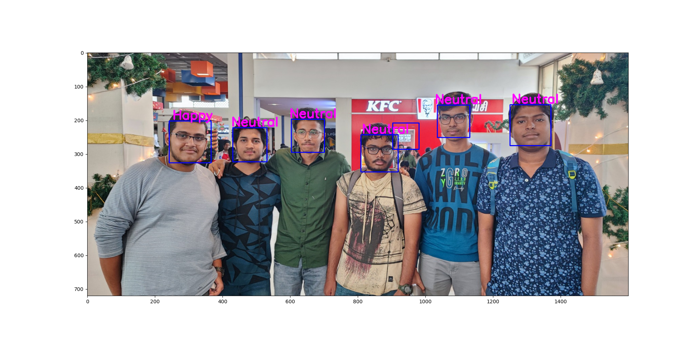

# FaceDontLie 👨‍💻
## Introduction to programming - ID1110 🖥️
## Project

### Brief Introduction
In this Project we have made an application which will capture our faces and detect our emotion in live feed as well as in a previously taken picture.

We have used the dataset "Face expression recognition dataset" by JONATHAN OHEIX which can be accessed using this link-
https://www.kaggle.com/datasets/jonathanoheix/face-expression-recognition-dataset

The Application uses a particular model 'model_weights.h5' which has been trained by the 'training.py' file using the above mentioned dataset

When we give the live feed of the webcam or a particular photo. The application predicts the emotion using the trained model.

For creating the GUI, we have used QT Designer

### References

The following websites were referred to during the development of this project:

- Kaggle Dataset: Face Expression Recognition Dataset
  - Link: https://www.kaggle.com/datasets/jonathanoheix/face-expression-recognition-dataset

- Kaggle Code: Face Expression Detection from Scratch
  - Link: https://www.kaggle.com/code/nakulsingh1289/face-expression-detection-from-scratch

- YouTube Tutorial: Face Expression Recognition Tutorial
  - Link: https://www.youtube.com/watch?v=fkgpvkqcoJc
  
- YouTube Tutorial: PyQt5 Python3 Tutorial
  - Link: https://www.youtube.com/playlist?list=PLzMcBGfZo4-lB8MZfHPLTEHO9zJDDLpYj

Images
### TEST CASE 1

### TEST CASE 2

### TEST CASE #

## Group Members
**- Sidarth Prabhu - 132201015**

**- Yash Yadav - 142201024**

**- Mukka Bharath Kumar Reddy - 122201024**

